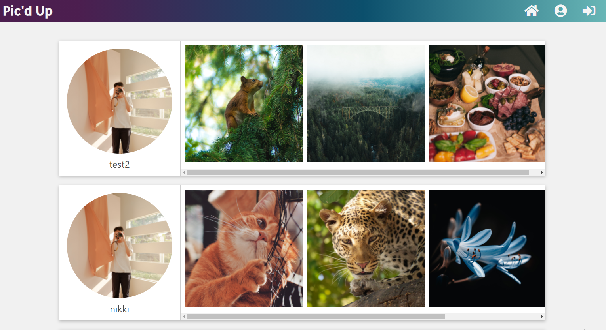
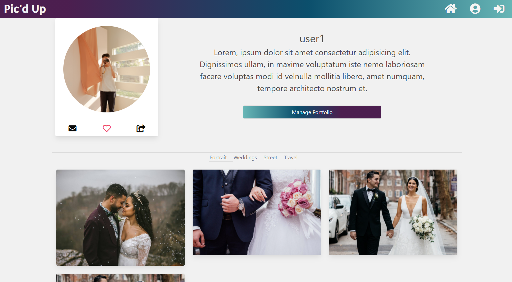

# Pic'd Up
  
  

  ## Description 
  Pic'd Up provides a space for photographers and potential clients to connect. 

  ### Photographers
  Photographers can showcase their work, uploading images to their profiles and adding a short bio. 
  ### Clients
  Clients can browse photographer's work and receive contact information to book the perfect photographer for their event.

  ## Table of Contents
  * [Links](#links)
  * [Techonologies](#techonologies)
  * [Installation](#installation)
  * [Usage](#usage)
  * [Contributors](#contributors)
  * [License](#license)
  
  ## Links
  Production Site: [`picd-up-project.herokuapp.com`](https://picd-up-project.herokuapp.com) 
  GitHub Repo: [`Ronan-Codes/Project-3`](https://github.com/Ronan-Codes/Project-3)
  
  ## Techonologies
  Pic'd Up uses a MERN technology stack to deliver a modern and scalable single-page apllication that is easy to maintain. The website utilizes GraphQL 

  * MongoDB - NoSql document-oriented database, which allows for flexible and scalable data storage
  * Express - modular, lightweight Node.js Web framework
  * React- JavaScript library that is ideal for building interfaces for single-page applications
  * Node- Node JS is a cross-platform, JavaScript runtime environment designed to run server-side JavaScript
  * GraphQL - a query language for APIs that allows for improved performance through reducing the number of required calls and 
  * JWT - JSON Web Token used to manage user authentication
  
  ## Installation
  
<i>Steps required to install application, dependencies and configure the environment:</i>

  1. Navigate to the root folder
  2. Use the command prompt to enter command: `npm run install` to install dependencies for both server and client
  
  ### Available Scripts

  `npm start`

  Runs the ap in the development environment
  Open [http://localhost:3000](http://localhost:3000) to view it in the browser.

  The page will reload if you make edits.\
  You will also see any lint errors in the console.

  `npm run build`

  navigate to Client using `cd client` from rood directory

  Builds the app for production to the `build` folder.\
  It correctly bundles React in production mode and optimizes the build for the best performance.

  The build is minified and the filenames include the hashes.\
  Your app is ready to be deployed!

  ## Usage
  
<i>Instructions for application usage including examples:</i>

  ### Dashboard
  
  From the [Dashboard](https://evening-refuge-82542.herokuapp.com/dashboard), clients can brows various photographers and their work
  

  ### Profile
  
  From the [Dashboard](https://evening-refuge-82542.herokuapp.com/profile), photographers can view images that they have uploaded 
  

  ### Add Images
  
  From the [Add New Images](https://evening-refuge-82542.herokuapp.com/add), photographers can upload or drag-drop images on this page to upload to thier portfolio

 
  
   

  ## Contributors
  
<i>Project Contributors/Authors:</i>

  * Justin Puzey
  * Nikki Misustin
  * Ronan Galves
  * Alex Godwin
  * Bryan Gill

  ## License
  The MIT License
  
  
